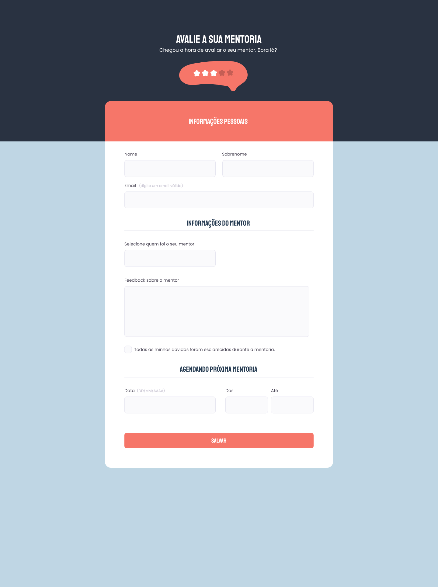

<h1> Formulário de Avaliação </h1>

 

<h2> O Projeto </h2>

O projeto foi desenvolvido como desafio do curso Explorer da Rocketseat. 

O desafio desse projeto consiste na criação de formulário de avaliação de mentoria. 

 

  

 

Quer conferir como ficou a landing page SpaceCream? 

[Visite o projeto online](https://eltonprado.github.io/Projeto07_FormularioAvaliacao/)

 

<h2> O intuito do projeto </h2>

O intuito do projeto foi colocar em prática os conhecimentos acerca de:

- HTML
  - id / class
  - input
  - properties
  - validação de formulário
- CSS
  - align-items / justify-content
  - gap / padding
  - position: absolute / relative
  - z-index
  - centralizar div com flex / margin
  - background: image / repeat / position
  - :nth-child() / :hover / ::before

 

<h2> Tecnologias </h2>

Foi utilizado as seguintes tecnologias para desenvolver esse projeto:

- HTML
- CSS
- figma
- Git
- GitHub